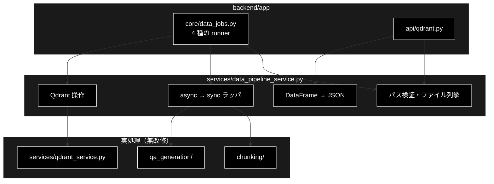
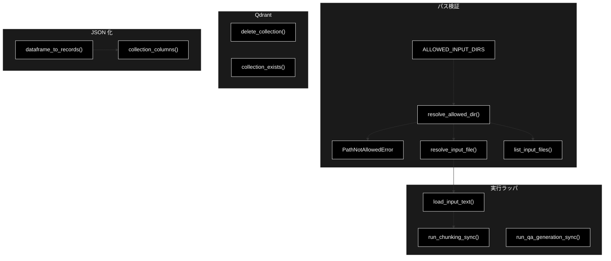
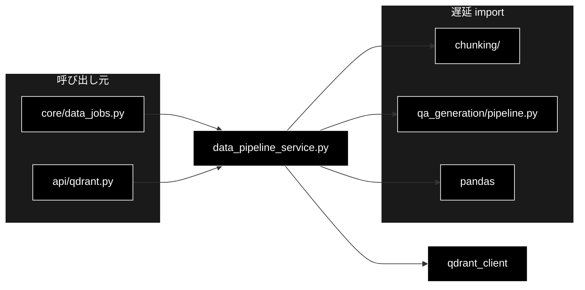

# data_pipeline_service.py - データ準備パイプラインの Web 向けラッパ層 ドキュメント

**Version 1.5** | 最終更新: 2026-10-10

---

## 目次

1. [概要](#概要)
2. [アーキテクチャ構成図](#1-アーキテクチャ構成図)
3. [モジュール構成図](#2-モジュール構成図)
4. [クラス・関数一覧表](#3-クラス関数一覧表)
5. [クラス・関数 IPO詳細](#4-クラス関数-ipo詳細)
6. [設定・定数](#5-設定定数)
7. [エクスポート](#6-エクスポート)
8. [変更履歴](#7-変更履歴)
9. [付録: 依存関係図](#付録-依存関係図)

---

## 概要

`services/data_pipeline_service.py` は、CLI スクリプトに埋め込まれていたデータ準備処理を
**Web API から呼べる関数として切り出す層**である。実処理は `chunking/` `qa_generation/`
`qa_qdrant/` `services/qdrant_service.py` が持ち続け、**既存モジュールの中身は一切変更していない。**

呼び出し元は `backend/app/core/data_jobs.py` の 4 つの runner
（`chunking` / `qa` / `register` / `delete`）と `backend/app/api/qdrant.py`。
設計全体は [`backend/docs/data_pipeline.md`](../../backend/docs/data_pipeline.md) を参照。

### 主な責務

- 入力ファイルのブラウズを、**許可ディレクトリ内に限定**して提供する
- async なチャンキング処理を、同期のジョブ runner から呼べるようにラップする
- Q/A 生成パイプラインを CLI と同じ経路で同期呼び出しする
- CLI の `main()` に直書きされていた Qdrant コレクションの一覧・削除を**関数**として提供する
- pandas DataFrame を返す既存 API を、JSON 化できる素の `dict` / `list` へ変換する

### 各責務対応のモジュール

| # | 責務 | 対応モジュール | 説明 |
|---|------|--------------|------|
| 1 | パス検証 | 本モジュール | ホワイトリスト ＋ `resolve()` の二段で基点の外を弾く |
| 2 | async → sync | 本モジュール | `chunks_all_async()` を `asyncio.run()` で包む |
| 3 | Q/A 生成の呼び出し | `qa_generation/pipeline.py` | `QAPipeline.run()` へ引数を詰め替えるだけ |
| 4 | Qdrant 操作 | `services/qdrant_service.py` | 一覧・削除の薄いラッパ |
| 5 | JSON 化 | 本モジュール | DataFrame の NaN を `None` へ寄せる |

### 主要機能一覧

| 機能 | 説明 |
|------|------|
| `ALLOWED_INPUT_DIRS` | 参照を許可する 4 ディレクトリ（backend / フロントと 1:1） |
| `PathNotAllowedError` | 許可外パスを指した |
| `resolve_allowed_dir()` | ディレクトリ名 → 絶対パス（検証つき） |
| `list_input_files()` | 入力ファイル候補の列挙（更新日時の降順） |
| `resolve_input_file()` | `dir/name` → 実パス |
| `delete_collection()` | コレクションを 1 つ削除（例外を投げず `bool`） |
| `collection_exists()` | 存在確認（削除前チェック用） |
| `dataframe_to_records()` | DataFrame → `list[dict]`（NaN → `None`） |
| `collection_columns()` | レコード列から出現順に列名を抽出 |
| `run_chunking_sync()` | `chunks_all_async()` の同期ラッパ |
| `run_qa_generation_sync()` | `QAPipeline.run()` の同期ラッパ |
| `load_input_text()` | CSV / テキストの読み込み |

---

## 1. アーキテクチャ構成図

### 1.1 システム全体構成


```mermaid
flowchart TB
    subgraph API["backend/app"]
        DJ["core/data_jobs.py<br>4 種の runner"]
        QAPI["api/qdrant.py"]
    end

    subgraph THIS["services/data_pipeline_service.py"]
        PATH["パス検証・ファイル列挙"]
        SYNC["async → sync ラッパ"]
        QD["Qdrant 操作"]
        JSONC["DataFrame → JSON"]
    end

    subgraph EXT["実処理（無改修）"]
        CHUNK["chunking/"]
        QAGEN["qa_generation/"]
        QSVC["services/qdrant_service.py"]
    end

    DJ --> PATH
    DJ --> SYNC
    DJ --> QD
    QAPI --> PATH
    QAPI --> JSONC
    SYNC --> CHUNK
    SYNC --> QAGEN
    QD --> QSVC
classDef default fill:#000,stroke:#fff,color:#fff
classDef subgraphStyle fill:#1a1a1a,stroke:#fff,color:#fff
class DJ,QAPI,PATH,SYNC,QD,JSONC,CHUNK,QAGEN,QSVC default
style API fill:#1a1a1a,stroke:#fff,color:#fff
style THIS fill:#1a1a1a,stroke:#fff,color:#fff
style EXT fill:#1a1a1a,stroke:#fff,color:#fff
```

### 1.2 データフロー

1. 画面がディレクトリを選ぶ → `list_input_files()` が候補を `dir/name` 形式で返す
2. ジョブ起動時、runner が `resolve_input_file()` で実パスへ戻す（許可外は例外）
3. チャンク化は `load_input_text()` → `run_chunking_sync()`
4. Q/A 生成は `run_qa_generation_sync()`（`QAPipeline` へ委譲）
5. 参照系は `dataframe_to_records()` / `collection_columns()` で JSON 化して返す

---

## 2. モジュール構成図

### 2.1 内部モジュール構成


```mermaid
flowchart TB
    subgraph GUARD["パス検証"]
        ALLOW["ALLOWED_INPUT_DIRS"]
        ERR["PathNotAllowedError"]
        RDIR["resolve_allowed_dir()"]
        RFILE["resolve_input_file()"]
        LIST["list_input_files()"]
    end

    subgraph RUN["実行ラッパ"]
        CH["run_chunking_sync()"]
        QA["run_qa_generation_sync()"]
        LOAD["load_input_text()"]
    end

    subgraph QDR["Qdrant"]
        DEL["delete_collection()"]
        EXIST["collection_exists()"]
    end

    subgraph CONV["JSON 化"]
        REC["dataframe_to_records()"]
        COL["collection_columns()"]
    end

    ALLOW --> RDIR
    RDIR --> RFILE
    RDIR --> LIST
    RDIR --> ERR
    RFILE --> LOAD
    LOAD --> CH
    REC --> COL
classDef default fill:#000,stroke:#fff,color:#fff
classDef subgraphStyle fill:#1a1a1a,stroke:#fff,color:#fff
class ALLOW,ERR,RDIR,RFILE,LIST,CH,QA,LOAD,DEL,EXIST,REC,COL default
style GUARD fill:#1a1a1a,stroke:#fff,color:#fff
style RUN fill:#1a1a1a,stroke:#fff,color:#fff
style QDR fill:#1a1a1a,stroke:#fff,color:#fff
style CONV fill:#1a1a1a,stroke:#fff,color:#fff
```

### 2.2 外部依存関係

| ライブラリ | 用途 |
|-----------|------|
| `qdrant-client` | `QdrantClient` の型・削除・一覧 |
| `pandas`（遅延 import） | DataFrame の NaN 処理 |

### 2.3 内部依存モジュール

| モジュール | 用途 | import のしかた |
|-----------|------|---|
| `chunking.checkpoint_manager` / `chunking.csv_text_to_chunks_text_csv` | チャンク化本体 | **関数内で遅延 import** |
| `qa_generation.pipeline.QAPipeline` | Q/A 生成本体 | **関数内で遅延 import** |

> 📝 **遅延 import は意図的。** `chunking` は tqdm / LLM SDK、`qa_generation` は
> celery / LLM クライアントを引き込む。コレクション一覧のようにこれらを通らない
> 経路へ import コストを払わせないため、モジュール先頭では読まない。

---

## 3. クラス・関数一覧表

### 3.1 クラス一覧

#### PathNotAllowedError

`ValueError` のサブクラス。許可ディレクトリの外を指すパスが渡されたことを表す。
API 層はこれを 400 / error イベントへ変換する。

### 3.2 関数一覧（カテゴリ別）

#### パス検証・ファイルブラウズ

| 関数名 | 概要 |
|-------|------|
| `resolve_allowed_dir(dir_name, base)` | 許可ディレクトリ名を絶対パスへ解決する |
| `list_input_files(dir_name, base, suffixes)` | 入力ファイル候補を更新日時の降順で列挙する |
| `resolve_input_file(rel_path, base)` | `dir/name` を実パスへ戻す |

#### Qdrant コレクション操作

| 関数名 | 概要 |
|-------|------|
| `delete_collection(client, collection_name)` | コレクションを 1 つ削除する（`bool` を返す） |
| `collection_exists(client, collection_name)` | 存在確認 |

#### JSON 化

| 関数名 | 概要 |
|-------|------|
| `dataframe_to_records(df)` | DataFrame → `list[dict]`（NaN → `None`） |
| `collection_columns(records)` | 出現順に列名を抽出する |

#### 実行ラッパ

| 関数名 | 概要 |
|-------|------|
| `run_chunking_sync(...)` | `chunks_all_async()` を `asyncio.run()` で包む |
| `run_qa_generation_sync(...)` | `QAPipeline.run()` へ引数を詰め替える |
| `load_input_text(path, ...)` | CSV / テキストを読み込む |

---

## 4. クラス・関数 IPO詳細

### 4.1 使用例

`data_pipeline_service` は、データ管理タブ（Web）と CLI が**同じ処理を呼ぶための薄い層**である。中身（チャンク化・Q/A 生成・Qdrant 操作）は
`chunking/` / `qa_generation/` / `qdrant_service.py` が持ち、ここは引数の詰め替え・同期化・パスの検証・JSON 化だけを行う。
呼び出し元は `backend/app/core/data_jobs.py`（ジョブのワーカースレッド）・`backend/app/api/qdrant.py`・`qa_qdrant/make_qa_register_qdrant.py`。使い方は次の 4 通り。

| 処理パターン | 呼び方 | 向いている場面 | 例 |
|---|---|---|---|
| 入力ファイルを選ぶ | `list_input_files(dir)` → `resolve_input_file("dir/name")` | 画面に候補を出し、選ばれたパスを検証して実パスへ戻す | 4.1.1 |
| チャンク化を同期で呼ぶ | `load_input_text(path)` → `run_chunking_sync(text, ...)` | ワーカースレッドから async のチャンク化を呼ぶ（データ管理タブ「① チャンキング」） | 4.1.2 |
| Q/A 生成を同期で呼ぶ | `run_qa_generation_sync(input_file, ...)` | チャンク済み CSV から Q/A を作る（「② Q/A 作成」・CLI の Phase 1） | 4.1.3 |
| コレクションを確かめて消す・表示用に直す | `collection_exists` / `delete_collection` / `dataframe_to_records` / `collection_columns` | 「④ コレクション管理」の一覧・中身・削除 | 4.1.4 |

> 📝 4 本とも**別プロセスでそのまま実行し**、出力を確かめてある（2026-10-10。カレントは一時ディレクトリ）。4.1.2 はチャンク化本体（`chunks_all_async`）を、
> 4.1.3 は `QAPipeline` をスタブにした（LLM を呼ばない。この層が引数を渡して戻り値を返すところまでを確かめた）。4.1.4 は**本物の Qdrant**（docker-compose）を使った。

#### 4.1.1 基本的なワークフロー（入力ファイルを選ぶ）

```python
from pathlib import Path

import pandas as pd

from services.data_pipeline_service import (
    ALLOWED_INPUT_DIRS,
    PathNotAllowedError,
    list_input_files,
    resolve_input_file,
)

# 用意: OUTPUT/ に入力 CSV を置く（基点はカレントディレクトリ＝リポジトリ直下の想定）
Path("OUTPUT").mkdir(exist_ok=True)
pd.DataFrame({"text": ["住民票の写しは市民課で請求できる。", "印鑑登録には本人確認書類が要る。"]}).to_csv("OUTPUT/gov_docs.csv", index=False)

# 1. 画面に出す候補（更新日時の新しい順。絶対パスは出さない）
files = list_input_files("OUTPUT")
print(ALLOWED_INPUT_DIRS, [(f["path"], f["suffix"]) for f in files])
print(list_input_files("datasets"))                 # 許可されていてもディレクトリが無ければ空

# 2. 選ばれた 'ディレクトリ/ファイル名' を検証して実パスへ戻す
print(resolve_input_file("OUTPUT/gov_docs.csv").name)
for bad in ("../etc/passwd", "OUTPUT/../config.yml", "logs/app.log"):
    try:
        resolve_input_file(bad)
    except PathNotAllowedError as e:
        print("拒否:", e)
```

```
# 出力例:
# ('OUTPUT', 'output_chunked', 'qa_output', 'datasets') [('OUTPUT/gov_docs.csv', '.csv')]
# []
# gov_docs.csv
# 拒否: 入力パスは 'ディレクトリ名/ファイル名' の形式で指定してください: '../etc/passwd'
# 拒否: 入力パスは 'ディレクトリ名/ファイル名' の形式で指定してください: 'OUTPUT/../config.yml'
# 拒否: 許可されていないディレクトリです: 'logs'（許可: ['OUTPUT', 'output_chunked', 'qa_output', 'datasets']）
```

> 📝 **ホワイトリスト（4 ディレクトリ）と `resolve()` の二段で検証する**。形式は `ディレクトリ名/ファイル名` の 1 段だけで、入れ子は受け付けない
> （`list_input_files` もサブディレクトリを見ない）。ファイルが無ければ `FileNotFoundError`。基点は `base=` で変えられる（省略時はカレント）。

#### 4.1.2 チャンク化を同期で呼ぶ（`run_chunking_sync`）

```python
import asyncio
from pathlib import Path

import pandas as pd

from services.data_pipeline_service import load_input_text, resolve_input_file, run_chunking_sync

Path("OUTPUT").mkdir(exist_ok=True)
pd.DataFrame({"text": ["住民票の写しは市民課で請求できる。", "", "印鑑登録には本人確認書類が要る。"]}).to_csv("OUTPUT/gov_docs.csv", index=False)

# 1. CSV はテキスト列（text / content / Combined_Text ... の順に探す）の空でない行を空行区切りで 1 本にする。CSV 以外は素読み
path = resolve_input_file("OUTPUT/gov_docs.csv")
text = load_input_text(path, max_rows=100)
print(repr(text))

# 2. async の chunks_all_async を、ワーカースレッドから同期で呼ぶ（中で asyncio.run する）
chunks = run_chunking_sync(
    text,
    model="claude-haiku-5-5",            # 画面の既定は config.py::ModelConfig.CHUNKING_MODEL
    max_workers=4,
    block_size=1000,
    output_file="output_chunked/gov_docs_chunks.csv",
    dataset_type="gov_docs",
    source_file=str(path),
)
print(len(chunks), Path("output_chunked/gov_docs_chunks.csv").exists())


# 3. ⚠️ イベントループの中（FastAPI の async ハンドラ等）から呼ぶと RuntimeError
async def handler():
    return run_chunking_sync(text, model="claude-haiku-5-5", max_workers=1, block_size=1000,
                             output_file="output_chunked/x.csv", dataset_type="x")

try:
    asyncio.run(handler())
except RuntimeError as e:
    print("RuntimeError:", str(e).split(" from ")[0])
```

```
# 出力例（チャンクの切り方は LLM による。ここではスタブ）:
# '住民票の写しは市民課で請求できる。\n\n印鑑登録には本人確認書類が要る。'
# 2 True
# RuntimeError: asyncio.run() cannot be called
```

> ⚠️ **必ずジョブのワーカースレッド（イベントループの無いスレッド）から呼ぶ。** `data_jobs.py` はそうしている。
> 途中経過は `./checkpoints/<job_id>/` に保存され（`CheckpointManager`）、`job_id` を渡すと同じジョブを続きから再開できる。

#### 4.1.3 Q/A 生成を同期で呼ぶ（`run_qa_generation_sync`）

```python
from services.data_pipeline_service import run_qa_generation_sync

result = run_qa_generation_sync(
    "output_chunked/gov_docs_chunks.csv",   # text / Combined_Text / content / chunk_text のどれかの列が要る
    model="claude-sonnet-5-5",              # 画面の既定は config.py::ModelConfig.DEFAULT_MODEL
    output_dir="qa_output",                 # ⚠️ 入れ子にしない（Qdrant 登録の画面が qa_output/ 直下しか見ない）
    max_docs=50,
    analyze_coverage=True,
)
print(result["success"], result["qa_count"], result["saved_files"]["qa_csv"])
```

```
# 出力例（件数・ファイル名は QAPipeline による。ここではスタブ）:
# True 6 qa_output/qa_pairs_chunks.csv
```

> 📝 `QAPipeline(...).run(...)` の戻り値をそのまま返す（`saved_files` / `qa_count` / `coverage_results` / `success`）。CLI の
> `make_qa_register_qdrant.py` の Phase 1 と同じ経路なので、CLI と画面で結果が食い違わない。
>
> ⚠️ `use_celery=True` は Celery ワーカーが起動していないと**例外になる**（`check_celery_workers`）。呼び出し側で握ってエラーとして返す
> （`data_jobs.py` は error イベントにする）。並列数はワーカー起動時の `-c` で決まり、`concurrency` はログ表示用。

#### 4.1.4 コレクションを確かめて消す・表示用に直す

```python
from qdrant_client import QdrantClient
from qdrant_client.http import models

from services.data_pipeline_service import (
    collection_columns,
    collection_exists,
    dataframe_to_records,
    delete_collection,
)
from services.qdrant_service import QdrantDataFetcher

client = QdrantClient(url="http://localhost:6333")
name = "doc_example_pipeline"
client.create_collection(name, vectors_config=models.VectorParams(size=4, distance=models.Distance.COSINE))
client.upsert(name, points=[
    models.PointStruct(id=1, vector=[1.0, 0, 0, 0], payload={"question": "住民票は？", "answer": "窓口です"}),
    models.PointStruct(id=2, vector=[0, 1.0, 0, 0], payload={"question": "印鑑登録は？", "chunk_id": "c-7"}),
])

# 1. 中身を JSON にできる形へ（DataFrame → list[dict]。欠けた値は NaN ではなく None）
records = dataframe_to_records(QdrantDataFetcher(client).fetch_collection_points(name, limit=10))
print(collection_columns(records))         # 最初に現れた順の列名（payload のキーはコレクションごとに違う）
print(records[1])

# 2. 消す前に存在を確かめる。削除は確認を挟まない（承認は呼び出し側＝Web は HITL CONFIRM）
print(collection_exists(client, name), delete_collection(client, name), collection_exists(client, name))
print(delete_collection(client, name))     # ⚠️ もう無くても True
```

```
# 出力例:
# ['ID', 'question', 'answer', 'chunk_id']
# {'ID': 2, 'question': '印鑑登録は？', 'answer': None, 'chunk_id': 'c-7'}
# True True False
# True
```

> ⚠️ **`delete_collection` は、コレクションが無くても `True` を返す**（qdrant-client の `delete_collection` が例外にせず `False` を返すのを見ていない。
> 関数の docstring は「存在しない場合は False」と書いているが、実装と違う。2026-10-10 に本物の Qdrant で確認）。`False` になるのは接続できない等で例外が出たときだけ。
> 消したかどうかは、前後で `collection_exists` を見る（`backend/app/api/qdrant.py` も先に存在を確かめている）。

---

### 4.2 パス検証

#### `resolve_allowed_dir`

**概要**: 許可ディレクトリ名を絶対パスへ解決する。

```python
def resolve_allowed_dir(dir_name: str, base: Optional[Path] = None) -> Path
```

| 項目 | 内容 |
|------|------|
| **Input** | `dir_name`（`ALLOWED_INPUT_DIRS` のいずれか）、`base`（基点。既定はカレント） |
| **Process** | ① ホワイトリスト照合<br>② `resolve()` した結果が基点配下にあることを確認 |
| **Output** | 絶対パス（`Path`）。違反時は `PathNotAllowedError` |

> ⚠️ **ホワイトリスト照合だけでは足りない。** `OUTPUT/../..` のような値に備え、
> `resolve()` 後の位置も確かめる二段構えにしてある。

#### `list_input_files`

**概要**: 許可ディレクトリ内の入力ファイル候補を列挙する。

```python
def list_input_files(
    dir_name: str,
    base: Optional[Path] = None,
    suffixes: tuple[str, ...] = (".csv", ".txt"),
) -> List[Dict[str, Any]]
```

| 項目 | 内容 |
|------|------|
| **Input** | `dir_name`、`base`、`suffixes`（既定は `.csv` / `.txt`） |
| **Process** | ① `resolve_allowed_dir()` で解決<br>② `iterdir()` でファイルのみ走査<br>③ 更新日時の降順にソート |
| **Output** | `[{"name", "path", "size", "modified", "suffix"}, ...]`。ディレクトリが無ければ空リスト |

**戻り値例**:

```python
[
    {"name": "cc_news_chunks.csv", "path": "output_chunked/cc_news_chunks.csv",
     "size": 20480, "modified": 1757635200.0, "suffix": ".csv"},
]
```

> ⚠️ **`iterdir()` は再帰しない。** サブディレクトリのファイルは列挙されないため、
> ジョブの出力先を入れ子にすると**次の工程の選択肢に出てこない**。
> `QaGenerationParams.output_dir` の既定を `qa_output/pipeline` ではなく
> `qa_output` 直下にしてあるのはこのためである。

> 📝 `path` は `dir/name` 形式に限定し、**絶対パスは返さない**。
> 画面へリポジトリの実パスを出さないための決まりごと。

#### `resolve_input_file`

**概要**: `list_input_files()` が返した `dir/name` を実パスへ戻す。

```python
def resolve_input_file(rel_path: str, base: Optional[Path] = None) -> Path
```

| 項目 | 内容 |
|------|------|
| **Input** | `rel_path`（`dir/name` 形式）、`base` |
| **Process** | ① `/` で 2 分割できるか検証<br>② ファイル名側に区切りが混ざっていないか検証<br>③ ディレクトリをホワイトリスト照合<br>④ `resolve()` 後に基点配下か検証<br>⑤ 実ファイルの存在確認 |
| **Output** | 絶対パス（`Path`）。違反は `PathNotAllowedError`、不在は `FileNotFoundError` |

### 4.3 実行ラッパ

#### `run_chunking_sync`

**概要**: `chunks_all_async()` を同期呼び出しできるようにラップする。

```python
def run_chunking_sync(
    text: str, *, model: str, max_workers: int, block_size: int,
    output_file: str, dataset_type: str,
    source_file: Optional[str] = None, job_id: Optional[str] = None,
) -> List[str]
```

| 項目 | 内容 |
|------|------|
| **Input** | 入力テキスト、モデル、並列数、ブロックサイズ、出力先、再開用 `job_id` |
| **Process** | ① `CheckpointManager` を用意（`job_id` があれば再開）<br>② `asyncio.run(chunks_all_async(...))` |
| **Output** | チャンク文字列のリスト（CSV の書き出しは `chunks_all_async()` 側が行う） |

> ⚠️ **`asyncio.run()` は「実行中のイベントループが無いこと」を要求する。**
> FastAPI の async ハンドラから直接呼ぶと
> `RuntimeError: asyncio.run() cannot be called from a running event loop` になる。
> **必ずジョブのワーカースレッド側から呼ぶこと。**

#### `run_qa_generation_sync`

**概要**: チャンク済み CSV から Q/A ペアを生成する（`QAPipeline` の同期ラッパー）。

```python
def run_qa_generation_sync(
    input_file: str, *, model: str, output_dir: str,
    max_docs: Optional[int] = None, use_celery: bool = False,
    concurrency: int = 8,
    analyze_coverage: bool = True,
) -> Dict[str, Any]
```

| 項目 | 内容 |
|------|------|
| **Input** | チャンク済み CSV のパス、モデル（Anthropic Claude）、出力先、最大チャンク数、Celery 設定、カバレージ分析の有無 |
| **Process** | ① `QAPipeline` を生成<br>② `run()` へ引数を詰め替えて呼ぶ（**パイプライン本体は無改修**） |
| **Output** | `QAPipeline.run()` の戻り値そのまま |

**戻り値例**:

```python
{
    "success": True,
    "qa_count": 42,
    "coverage_results": {"coverage_rate": 0.83, "covered_chunks": 10, "total_chunks": 12},
    "saved_files": {"qa_csv": "qa_output/qa_pairs_x_20260912_010203.csv",
                    "qa_json": "qa_output/qa_pairs_x_20260912_010203.json"},
}
```

> 📝 **`run_chunking_sync()` と違い `asyncio.run()` は挟まない。**
> `QAPipeline.run()` は同期関数で、並列化は Celery（`use_celery=True`）の中に閉じている。`use_celery=False` ならチャンクを 1 件ずつ順に処理する。

> ⚠️ **Celery ワーカーが立っていないときに `use_celery=True` を渡すと例外を投げる**
> （`check_celery_workers` が失敗する）。呼び出し側で握って error イベントへ変換すること。
> ワーカーの起動は `./start_celery.sh restart -c 8`。

> 📝 `celery_workers=1` を固定で渡しているが、これは**ワーカー数のチェック用**であって
> 並列度ではない。`concurrency` もログ表示用で、実際の並列数は**ワーカー起動時の `-c`**（`./start_celery.sh restart -c 8`）が決める。
> 以前あった `batch_chunks`（1 回の LLM 呼び出しで渡すチャンク数）は処理に使われていなかったため 2026-10-09 に削除した。

### 4.4 JSON 化

#### `dataframe_to_records`

**概要**: pandas DataFrame を JSON 化できる `list[dict]` へ変換する。

```python
def dataframe_to_records(df: Any) -> List[Dict[str, Any]]
```

| 項目 | 内容 |
|------|------|
| **Input** | DataFrame（`None` / 空も可） |
| **Process** | ① `None`・空を早期 return<br>② `astype(object).where(pd.notnull(df), None)` で NaN を `None` へ |
| **Output** | `list[dict]`。変換に失敗したらログを出して空リスト |

> ⚠️ **NaN を残すと JSON が壊れる。** `json.dumps` は `NaN` という**不正なトークン**を
> 出力するため、フロントの `JSON.parse` が失敗する。

---

## 5. 設定・定数

### `ALLOWED_INPUT_DIRS`

```python
ALLOWED_INPUT_DIRS: tuple[str, ...] = (
    "OUTPUT",          # 生データ（チャンク化の入力）
    "output_chunked",  # チャンク化の出力（Q/A 生成の入力）
    "qa_output",       # Q/A 生成の出力（Qdrant 登録の入力）
    "datasets",        # ダウンロードしたデータセット
)
```

**ここに無いディレクトリは参照させない。** パイプラインの流れ順に並んでおり、
フロントの `INPUT_DIRS`（`frontend/src/state/dataParams.ts`）と **1:1** で対応する。
片方だけ足すと画面に出ないか 400 になるので、**必ず両方に足す**。


---

## 6. エクスポート

`__all__` の定義は無い。公開要素は以下のとおり。

```python
# 定数・例外
ALLOWED_INPUT_DIRS, PathNotAllowedError

# パス検証・ファイルブラウズ
resolve_allowed_dir, list_input_files, resolve_input_file

# Qdrant
delete_collection, collection_exists

# JSON 化
dataframe_to_records, collection_columns

# 実行ラッパ
run_chunking_sync, run_qa_generation_sync, load_input_text
```

---

## 7. 変更履歴

| バージョン | 日付 | 変更内容 |
|---|---|---|
| 1.0 | 2026-09-12 | 初版作成。`services/docs/` で唯一欠けていた本モジュールを IPO 形式で記述。`run_qa_generation_sync()`（2026-09-12 追加）を含む（2026-09-12） |
| 1.1 | 2026-09-24 | 使用例を IPO 詳細の冒頭（`### 4.1 使用例`）へ移し、末尾の「## 6. 使用例」章を削除（基本フォーマット `a_class_method_md_format.md` v1.6〜 §6.1 に準拠。2026-09-24）。IPO の小節を 4.2 以降へ繰り下げ、後続の章番号を 1 つ繰り上げた。文書内の `§4.x` 参照も追随。あわせて主な責務を各責務対応のモジュール（5 行）と 1:1 に並べ直した。使用例の `model` を現行の既定 `claude-sonnet-5` へ |
| 1.2 | 2026-10-08 | 軽量モデルを Haiku 4.5（`claude-haiku-4-5` / `claude-haiku-4-5-20251001`）から Claude Haiku 5.5（`claude-haiku-5-5`）へ変更したのに追随（2026-10-08） |
| 1.3 | 2026-10-08 | 使用例の `model` を現行の既定 `claude-sonnet-5-5`（`data_jobs.QaGenerationParams.model` と同じ）へ（2026-10-08） |
| 1.4 | 2026-10-09 | `run_qa_generation_sync()` から処理に効いていなかった `batch_chunks` を削除。`concurrency` はログ表示用で実際の並列数はワーカーの `-c` で決まること、並列化は Celery の中だけ（`ThreadPoolExecutor` は使っていない）であることへ記述を是正（2026-10-09） |
| 1.5 | 2026-10-10 | §4.1 使用例を処理パターン別（入力ファイルを選ぶ／チャンク化を同期で呼ぶ／Q/A 生成を同期で呼ぶ／コレクションを確かめて消す・表示用に直す）の 4 本に書き直した（2026-10-10。`grace/docs/executor.md` §4.1 を手本に、処理パターンの表 → パターンごとの例 → 落とし穴の注記の形にし、別プロセスで全例を実行して出力を確かめた）。4.1.4 は本物の Qdrant を使い、`delete_collection` がコレクションが無くても `True` を返すこと（docstring と違う）を見つけて注記。イベントループの中から `run_chunking_sync` を呼ぶと `RuntimeError` になることを例で示した |

---

## 付録: 依存関係図


```mermaid
flowchart LR
    DPS["data_pipeline_service.py"]

    subgraph CALLERS["呼び出し元"]
        DJOBS["core/data_jobs.py"]
        AQ["api/qdrant.py"]
    end

    subgraph LAZY["遅延 import"]
        CHUNKPKG["chunking/"]
        QAPKG["qa_generation/pipeline.py"]
        PANDAS["pandas"]
    end

    QC["qdrant_client"]

    DJOBS --> DPS
    AQ --> DPS
    DPS --> CHUNKPKG
    DPS --> QAPKG
    DPS --> PANDAS
    DPS --> QC
classDef default fill:#000,stroke:#fff,color:#fff
classDef subgraphStyle fill:#1a1a1a,stroke:#fff,color:#fff
class DPS,DJOBS,AQ,CHUNKPKG,QAPKG,PANDAS,QC default
style CALLERS fill:#1a1a1a,stroke:#fff,color:#fff
style LAZY fill:#1a1a1a,stroke:#fff,color:#fff
```
