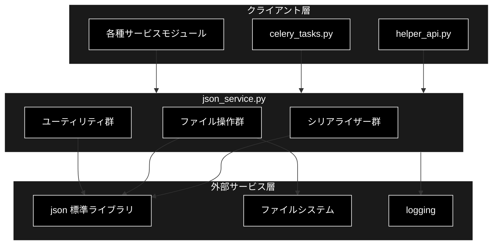
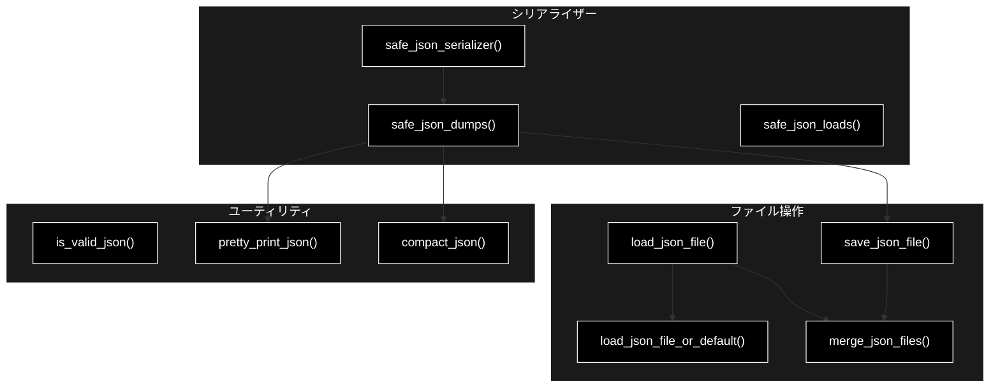
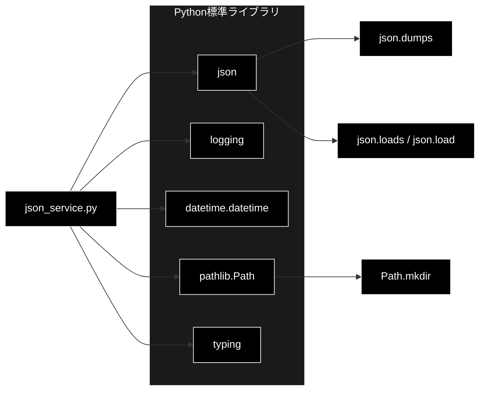

# json_service.py - JSON処理サービス ドキュメント

**Version 1.2** | 最終更新: 2026-10-10

---

## 目次

1. [概要](#概要)
2. [アーキテクチャ構成図](#1-アーキテクチャ構成図)
3. [モジュール構成図](#2-モジュール構成図)
4. [クラス・関数一覧表](#3-クラス関数一覧表)
5. [クラス・関数 IPO詳細](#4-クラス関数-ipo詳細)
6. [設定・定数](#5-設定定数)
7. [エクスポート](#6-エクスポート)
8. [変更履歴](#7-変更履歴)
9. [付録: 依存関係図](#付録-依存関係図)

---

## 概要

`json_service.py`は、安全なJSONシリアライズ・デシリアライズおよびJSONファイルの読み書きを提供するユーティリティモジュールです。Pydanticモデルや`datetime`、`bytes`、`set`など標準の`json`モジュールでは直接処理できないオブジェクトを安全に変換し、例外発生時にもフォールバック値を返すことで、Anthropic Claude応答ログやQ&A生成結果などの永続化を堅牢に行います。

本モジュールは元々`helper_api.py`に分散していたJSON関連処理（`safe_json_serializer` / `safe_json_dumps` / `load_json_file` / `save_json_file`）を集約・統合したサービスです。

### 主な責務

- 標準で処理できないオブジェクトのJSON互換変換（カスタムシリアライザー）
- 例外安全なJSON文字列化・パース
- JSONファイルの読み込み・保存（ディレクトリ自動生成）
- 複数JSONファイルのマージ
- JSON妥当性検証および整形・コンパクト出力

### 各責務対応のモジュール

| # | 責務 | 対応モジュール | 説明 |
|---|------|--------------|------|
| 1 | 標準で処理できないオブジェクトのJSON互換変換 | `json_service.py` | `safe_json_serializer()`がPydantic/datetime/bytes/set等を変換 |
| 2 | 例外安全なJSON文字列化・パース | `json_service.py` | `safe_json_dumps()` / `safe_json_loads()`がエラー時にフォールバック |
| 3 | JSONファイルの読み込み・保存 | `json_service.py` | `load_json_file()` / `save_json_file()`がI/Oを管理 |
| 4 | 複数JSONファイルのマージ | `json_service.py` | `merge_json_files()`が複数ファイルを統合 |
| 5 | JSON妥当性検証および整形・コンパクト出力 | `json_service.py` | `is_valid_json()` / `pretty_print_json()` / `compact_json()` |

### 主要機能一覧

| 機能 | 説明 |
|------|------|
| `safe_json_serializer()` | 標準で処理できないオブジェクトをJSON互換形式に変換 |
| `safe_json_dumps()` | 例外安全なJSON文字列化（フォールバック付き） |
| `safe_json_loads()` | 例外安全なJSONパース（デフォルト値付き） |
| `load_json_file()` | JSONファイルを読み込む（エラー時None） |
| `save_json_file()` | JSONファイルを保存する（ディレクトリ自動生成） |
| `load_json_file_or_default()` | JSONファイル読み込み（存在しない場合デフォルト値） |
| `merge_json_files()` | 複数JSONファイルをマージ |
| `is_valid_json()` | 文字列が有効なJSONか検証 |
| `pretty_print_json()` | JSONを整形して文字列化（indent=4） |
| `compact_json()` | JSONをコンパクトに文字列化（改行・空白なし） |

---

## 1. アーキテクチャ構成図

### 1.1 システム全体構成



### 1.2 データフロー

1. クライアント層（`helper_api.py`等）がJSON処理を要求
2. シリアライザー群が標準で処理できないオブジェクトを変換
3. ファイル操作群がファイルシステムへ読み書き
4. 例外発生時は`logging`へ記録し、フォールバック値または`None`を返却

---

## 2. モジュール構成図

### 2.1 内部モジュール構成



### 2.2 外部依存関係

| ライブラリ | バージョン | 用途 |
|-----------|-----------|------|
| `json` | 標準 | JSONシリアライズ・パース |
| `logging` | 標準 | エラー・警告ログ出力 |
| `datetime` | 標準 | `datetime`オブジェクトのISO形式変換 |
| `pathlib` | 標準 | 出力ディレクトリの自動生成 |
| `typing` | 標準 | 型ヒント |

### 2.3 内部依存モジュール

なし（標準ライブラリのみで完結）

---

## 3. クラス・関数一覧表

> 本モジュールにクラスは定義されていません。関数のみで構成されます。

### 3.1 関数一覧（カテゴリ別）

#### シリアライザー

| 関数名 | 概要 |
|-------|------|
| `safe_json_serializer(obj)` | 標準で処理できないオブジェクトをJSON互換形式に変換 |
| `safe_json_dumps(data, **kwargs)` | 例外安全なJSON文字列化 |
| `safe_json_loads(data, default)` | 例外安全なJSONパース |

#### ファイル操作

| 関数名 | 概要 |
|-------|------|
| `load_json_file(filepath)` | JSONファイルを読み込む |
| `save_json_file(data, filepath)` | JSONファイルを保存する |
| `load_json_file_or_default(filepath, default)` | 読み込み（存在しない場合デフォルト値） |
| `merge_json_files(filepaths, output_path)` | 複数JSONファイルをマージ |

#### ユーティリティ

| 関数名 | 概要 |
|-------|------|
| `is_valid_json(data)` | 文字列が有効なJSONか検証 |
| `pretty_print_json(data)` | JSONを整形して文字列化 |
| `compact_json(data)` | JSONをコンパクトに文字列化 |

---

## 4. クラス・関数 IPO詳細

### 4.1 使用例

`json_service` は**例外を外へ投げない** JSON の入出力（失敗はログに出して `None` や既定値を返す）。使い方は次の 4 通り。

| 処理パターン | 呼び方 | 向いている場面 | 例 |
|---|---|---|---|
| 文字列とデータを相互に変換する | `safe_json_dumps(data)` / `safe_json_loads(text, default=...)` | 日時・集合・Pydantic を含むデータ、壊れているかもしれない LLM 応答 | 4.1.1 |
| ファイルに読み書きする | `save_json_file(data, path)` / `load_json_file(path)` / `load_json_file_or_default(path, default)` | 結果や設定の保存・読み込み | 4.1.2 |
| 複数のファイルをまとめる | `merge_json_files(paths, output_path=...)` | 分割して保存した辞書を 1 つにする | 4.1.3 |
| 検査と整形 | `is_valid_json` / `pretty_print_json` / `compact_json` | ログ表示・送信前の検査 | 4.1.4 |

> 📝 4 本とも**別プロセスでそのまま実行し**、出力を確かめてある（2026-10-10。ファイルは一時ディレクトリへ書いた。外部は使わない）。

#### 4.1.1 基本的なワークフロー（文字列とデータを相互に変換する）

```python
from datetime import datetime

from pydantic import BaseModel

from services.json_service import safe_json_dumps, safe_json_loads


class QA(BaseModel):
    question: str
    answer: str


data = {
    "qa": QA(question="住民票は？", answer="窓口で請求できます"),   # Pydantic → model_dump()
    "created": datetime(2026, 10, 10, 9, 30),                          # datetime → ISO 形式
    "tags": {"gov"},                                                   # set → list
}
text = safe_json_dumps(data, indent=None)       # 既定は ensure_ascii=False・indent=2
print(text)

print(safe_json_loads(text)["qa"]["answer"])
print(safe_json_loads("{壊れた JSON", default={}))   # 例外にせず既定値（エラーはログに出る）
```

```
# 出力例:
# {"qa": {"question": "住民票は？", "answer": "窓口で請求できます"}, "created": "2026-10-10T09:30:00", "tags": ["gov"]}
# 窓口で請求できます
# {}
```

> 📝 変換できない型は最後に `str(obj)` になる（例外にしない）。`model_dump` / `dict` を持つもの・`prompt_tokens` と `completion_tokens` を持つ使用量オブジェクト・
> `bytes`（UTF-8 で読めなければ 16 進）も変換する。

#### 4.1.2 ファイルに読み書きする

```python
import tempfile
from pathlib import Path

from services.json_service import load_json_file, load_json_file_or_default, save_json_file

out = Path(tempfile.mkdtemp()) / "nested" / "qa_result.json"     # 親ディレクトリが無くても作る
print(save_json_file({"query": "RAGとは", "score": 0.92}, str(out)))
print(load_json_file(str(out)))

print(load_json_file(str(out.with_name("missing.json"))))                       # 無いファイル → None
print(load_json_file_or_default(str(out.with_name("missing.json")), {"items": []}))
```

```
# 出力例:
# True
# {'query': 'RAGとは', 'score': 0.92}
# None
# {'items': []}
```

> ⚠️ **失敗しても例外にならない**（読み込みは `None`、保存は `False`）。戻り値を見ずに使うと、壊れた JSON と「ファイルが無い」の区別がつかない。
> 区別が必要なら、先に `Path(path).exists()` を確かめる。

#### 4.1.3 複数のファイルをまとめる（`merge_json_files`）

```python
import tempfile
from pathlib import Path

from services.json_service import merge_json_files, save_json_file

d = Path(tempfile.mkdtemp())
save_json_file({"gov": 120, "ec": 80}, str(d / "part1.json"))
save_json_file({"ec": 95, "saas": 60}, str(d / "part2.json"))

merged = merge_json_files(
    [str(d / "part1.json"), str(d / "part2.json"), str(d / "missing.json")],   # 読めないファイルは飛ばす
    output_path=str(d / "merged.json"),
)
print(merged, (d / "merged.json").exists())
```

```
# 出力例:
# {'gov': 120, 'ec': 95, 'saas': 60} True
```

> ⚠️ **トップレベルの辞書を浅く上書きするだけ**（同じキーは後のファイルが勝つ。入れ子の辞書は混ぜない）。
> 中身がリストの JSON を渡すと `ValueError` になる（ここだけ例外が外へ出る）。

#### 4.1.4 検査と整形

```python
from services.json_service import compact_json, is_valid_json, pretty_print_json

data = {"query": "住民票", "hits": [1, 2]}
print(is_valid_json('{"a": 1}'), is_valid_json("{a: 1}"), is_valid_json(None))
print(compact_json(data))
print(pretty_print_json(data))   # indent=4
```

```
# 出力例:
# True False False
# {"query":"住民票","hits":[1,2]}
# {
#     "query": "住民票",
#     "hits": [
#         1,
#         2
#     ]
# }
```

---

### 4.2 シリアライザー関数

#### `safe_json_serializer`

**概要**: 標準の`json`モジュールでは処理できないオブジェクト（Pydanticモデル・`datetime`・`bytes`・`set`・Anthropic Claude/OpenAI互換のUsageオブジェクト等）をJSON互換形式へ変換するカスタムシリアライザー。`json.dumps`の`default`引数として使用される。

```python
def safe_json_serializer(obj: Any) -> Any
```

| パラメータ | 型 | デフォルト | 説明 |
|------------|------|-----------|------|
| `obj` | Any | - | シリアライズ対象オブジェクト |

| 項目 | 内容 |
|------|------|
| **Input** | `obj: Any` |
| **Process** | 1. `model_dump()`を持つ場合は呼び出し（Pydantic）<br>2. `dict()`を持つ場合は呼び出し<br>3. `datetime`は`isoformat()`へ変換<br>4. `prompt_tokens`/`completion_tokens`を持つ場合はトークン辞書へ変換<br>5. `bytes`はUTF-8デコード（失敗時hex）<br>6. `set`はリスト化<br>7. それ以外は`str()`で文字列化 |
| **Output** | `Any`: JSON互換形式に変換されたオブジェクト |

**戻り値例**:
```python
{
    "prompt_tokens": 120,
    "completion_tokens": 45,
    "total_tokens": 165
}
```

```python
# 使用例
from datetime import datetime
from services.json_service import safe_json_serializer

result = safe_json_serializer(datetime(2026, 6, 17, 10, 0, 0))
print(result)
# 出力: 2026-06-17T10:00:00
```

#### `safe_json_dumps`

**概要**: 例外安全なJSON文字列化関数。`safe_json_serializer`を`default`に指定し、`ensure_ascii=False`・`indent=2`をデフォルトとする。失敗時は文字列化フォールバックを行う。

```python
def safe_json_dumps(data: Any, **kwargs) -> str
```

| パラメータ | 型 | デフォルト | 説明 |
|------------|------|-----------|------|
| `data` | Any | - | シリアライズ対象データ |
| `**kwargs` | Any | - | `json.dumps`へ渡す追加引数 |

| 項目 | 内容 |
|------|------|
| **Input** | `data: Any`, `**kwargs` |
| **Process** | 1. デフォルト引数（`ensure_ascii=False`, `indent=2`, `default=safe_json_serializer`）を構築<br>2. `kwargs`で上書き<br>3. `json.dumps`を実行<br>4. 例外時はエラーログ出力後、文字列化してフォールバック |
| **Output** | `str`: JSON文字列 |

**戻り値例**:
```python
'{\n  "name": "テスト",\n  "count": 3\n}'
```

```python
# 使用例
from services.json_service import safe_json_dumps

text = safe_json_dumps({"name": "テスト", "count": 3})
print(text)
# 出力:
# {
#   "name": "テスト",
#   "count": 3
# }
```

#### `safe_json_loads`

**概要**: 例外安全なJSONパース関数。パース失敗時はエラーログを出力し、指定されたデフォルト値を返す。

```python
def safe_json_loads(data: str, default: Any = None) -> Any
```

| パラメータ | 型 | デフォルト | 説明 |
|------------|------|-----------|------|
| `data` | str | - | JSON文字列 |
| `default` | Any | None | パースエラー時のデフォルト値 |

| 項目 | 内容 |
|------|------|
| **Input** | `data: str`, `default: Any = None` |
| **Process** | 1. `json.loads`を実行<br>2. `JSONDecodeError`時はエラーログ出力し`default`を返却<br>3. その他例外時もエラーログ出力し`default`を返却 |
| **Output** | `Any`: パース結果（エラー時は`default`） |

**戻り値例**:
```python
{"status": "ok", "value": 42}
```

```python
# 使用例
from services.json_service import safe_json_loads

data = safe_json_loads('{"status": "ok", "value": 42}')
print(data["value"])
# 出力: 42

fallback = safe_json_loads("invalid json", default={})
print(fallback)
# 出力: {}
```

### 4.3 ファイル操作関数

#### `load_json_file`

**概要**: JSONファイルを読み込み、辞書として返す。ファイル未存在・デコードエラー・その他例外時はログを出力し`None`を返す。

```python
def load_json_file(filepath: str) -> Optional[Dict[str, Any]]
```

| パラメータ | 型 | デフォルト | 説明 |
|------------|------|-----------|------|
| `filepath` | str | - | 読み込むファイルパス |

| 項目 | 内容 |
|------|------|
| **Input** | `filepath: str` |
| **Process** | 1. UTF-8でファイルを開く<br>2. `json.load`で読み込み<br>3. `FileNotFoundError`時は警告ログ出力し`None`<br>4. `JSONDecodeError`/その他例外時はエラーログ出力し`None` |
| **Output** | `Optional[Dict[str, Any]]`: 読み込んだデータ（エラー時`None`） |

**戻り値例**:
```python
{
    "version": "1.0",
    "items": [1, 2, 3]
}
```

```python
# 使用例
from services.json_service import load_json_file

config = load_json_file("config.json")
if config is not None:
    print(config["version"])
# 出力: 1.0
```

#### `save_json_file`

**概要**: データをJSONファイルへ保存する。親ディレクトリが存在しない場合は自動生成し、`safe_json_dumps`を用いて安全に書き込む。

```python
def save_json_file(data: Dict[str, Any], filepath: str) -> bool
```

| パラメータ | 型 | デフォルト | 説明 |
|------------|------|-----------|------|
| `data` | Dict[str, Any] | - | 保存するデータ |
| `filepath` | str | - | 保存先ファイルパス |

| 項目 | 内容 |
|------|------|
| **Input** | `data: Dict[str, Any]`, `filepath: str` |
| **Process** | 1. 親ディレクトリを`mkdir(parents=True, exist_ok=True)`で作成<br>2. `safe_json_dumps`でJSON文字列化<br>3. UTF-8でファイルへ書き込み<br>4. 例外時はエラーログ出力し`False` |
| **Output** | `bool`: 成功時`True`、失敗時`False` |

**戻り値例**:
```python
True
```

```python
# 使用例
from services.json_service import save_json_file

ok = save_json_file({"result": "success"}, "output/result.json")
print(ok)
# 出力: True
```

#### `load_json_file_or_default`

**概要**: JSONファイルを読み込み、存在しない・読み込み失敗時はデフォルト値を返すラッパー関数。

```python
def load_json_file_or_default(filepath: str, default: Any = None) -> Any
```

| パラメータ | 型 | デフォルト | 説明 |
|------------|------|-----------|------|
| `filepath` | str | - | 読み込むファイルパス |
| `default` | Any | None | ファイル未存在時のデフォルト値 |

| 項目 | 内容 |
|------|------|
| **Input** | `filepath: str`, `default: Any = None` |
| **Process** | 1. `load_json_file`を呼び出し<br>2. 結果が`None`でなければそれを返却<br>3. `None`の場合は`default`を返却 |
| **Output** | `Any`: 読み込んだデータまたは`default` |

**戻り値例**:
```python
{"items": []}
```

```python
# 使用例
from services.json_service import load_json_file_or_default

data = load_json_file_or_default("missing.json", default={"items": []})
print(data)
# 出力: {'items': []}
```

#### `merge_json_files`

**概要**: 複数のJSONファイルを読み込み、辞書を順次`update`してマージする。`output_path`指定時はマージ結果を保存する。

```python
def merge_json_files(filepaths: list, output_path: str = None) -> Dict[str, Any]
```

| パラメータ | 型 | デフォルト | 説明 |
|------------|------|-----------|------|
| `filepaths` | list | - | マージするファイルパスのリスト |
| `output_path` | str | None | 出力先パス（省略時は保存しない） |

| 項目 | 内容 |
|------|------|
| **Input** | `filepaths: list`, `output_path: str = None` |
| **Process** | 1. 空辞書を初期化<br>2. 各ファイルを`load_json_file`で読み込み<br>3. データが存在すれば`update`でマージ<br>4. `output_path`指定時は`save_json_file`で保存 |
| **Output** | `Dict[str, Any]`: マージされたデータ |

**戻り値例**:
```python
{
    "a": 1,
    "b": 2,
    "c": 3
}
```

```python
# 使用例
from services.json_service import merge_json_files

merged = merge_json_files(["part1.json", "part2.json"], output_path="all.json")
print(merged)
# 出力: {'a': 1, 'b': 2, 'c': 3}
```

### 4.4 ユーティリティ関数

#### `is_valid_json`

**概要**: 文字列が有効なJSONかどうかを検証する。パース可能なら`True`、`JSONDecodeError`または`TypeError`時は`False`を返す。

```python
def is_valid_json(data: str) -> bool
```

| パラメータ | 型 | デフォルト | 説明 |
|------------|------|-----------|------|
| `data` | str | - | チェック対象文字列 |

| 項目 | 内容 |
|------|------|
| **Input** | `data: str` |
| **Process** | 1. `json.loads`を実行<br>2. 成功時`True`<br>3. `JSONDecodeError`/`TypeError`時`False` |
| **Output** | `bool`: 有効なJSONの場合`True` |

**戻り値例**:
```python
True
```

```python
# 使用例
from services.json_service import is_valid_json

print(is_valid_json('{"x": 1}'))
# 出力: True
print(is_valid_json("not json"))
# 出力: False
```

#### `pretty_print_json`

**概要**: データをインデント幅4で整形したJSON文字列にする。内部で`safe_json_dumps`を使用するため安全に処理される。

```python
def pretty_print_json(data: Any) -> str
```

| パラメータ | 型 | デフォルト | 説明 |
|------------|------|-----------|------|
| `data` | Any | - | 整形対象データ |

| 項目 | 内容 |
|------|------|
| **Input** | `data: Any` |
| **Process** | `safe_json_dumps(data, indent=4)`を呼び出し |
| **Output** | `str`: 整形されたJSON文字列 |

**戻り値例**:
```python
'{\n    "key": "value"\n}'
```

```python
# 使用例
from services.json_service import pretty_print_json

print(pretty_print_json({"key": "value"}))
# 出力:
# {
#     "key": "value"
# }
```

#### `compact_json`

**概要**: データを改行・空白なしのコンパクトなJSON文字列にする。区切り文字に`(',', ':')`を使用し最小サイズで出力する。

```python
def compact_json(data: Any) -> str
```

| パラメータ | 型 | デフォルト | 説明 |
|------------|------|-----------|------|
| `data` | Any | - | 対象データ |

| 項目 | 内容 |
|------|------|
| **Input** | `data: Any` |
| **Process** | `safe_json_dumps(data, indent=None, separators=(',', ':'))`を呼び出し |
| **Output** | `str`: コンパクトなJSON文字列 |

**戻り値例**:
```python
'{"a":1,"b":2}'
```

```python
# 使用例
from services.json_service import compact_json

print(compact_json({"a": 1, "b": 2}))
# 出力: {"a":1,"b":2}
```

---

## 5. 設定・定数

本モジュールには公開された設定辞書・定数は定義されていません。

`safe_json_dumps`の内部デフォルト引数として、以下が暗黙的に使用されます。

| キー | デフォルト値 | 説明 |
|-----|-------------|------|
| `ensure_ascii` | `False` | 日本語等の非ASCII文字をエスケープしない |
| `indent` | `2` | インデント幅 |
| `default` | `safe_json_serializer` | カスタムシリアライザー |


---

## 6. エクスポート

`__all__`で公開される要素：

```python
__all__ = [
    # シリアライザー
    "safe_json_serializer",
    "safe_json_dumps",
    "safe_json_loads",
    # ファイル操作
    "load_json_file",
    "save_json_file",
    "load_json_file_or_default",
    "merge_json_files",
    # ユーティリティ
    "is_valid_json",
    "pretty_print_json",
    "compact_json",
]
```

---

## 7. 変更履歴

| バージョン | 日付 | 変更内容 |
|---|---|---|
| 1.0 | 2026-06-17 | 初版作成（2026-06-17） |
| 1.1 | 2026-09-24 | 使用例を IPO 詳細の冒頭（`### 4.1 使用例`）へ移し、末尾の「## 6. 使用例」章を削除（基本フォーマット `a_class_method_md_format.md` v1.6〜 §6.1 に準拠。2026-09-24）。IPO の小節を 4.2 以降へ繰り下げ、後続の章番号を 1 つ繰り上げた。文書内の `§4.x` 参照も追随 |
| 1.2 | 2026-10-10 | §4.1 使用例を処理パターン別（文字列⇔データ／ファイル／複数ファイルの統合／検査と整形）の 4 本に書き直した（2026-10-10。`grace/docs/executor.md` §4.1 を手本に、処理パターンの表 → パターンごとの例 → 落とし穴の注記の形にし、別プロセスで全例を実行して出力を確かめた）。`merge_json_files` は浅い上書きで、リストの JSON では `ValueError` になることを明記 |

---

## 付録: 依存関係図


